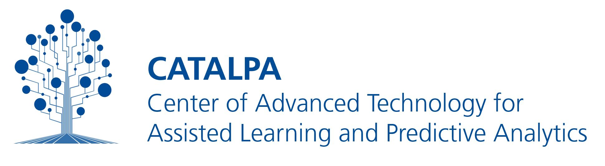
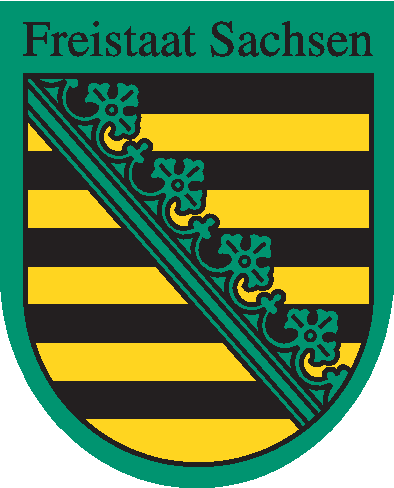

# Designing Video Interfaces

_Designing Video Interfaces_ is a web applications for exploring interaction design patterns and video learning environments documented in Niels Seidel's PhD research.

[](https://github.com/CATALPAresearch/video-patterns/commit-activity)
[](http://perso.crans.org/besson/LICENSE.html)


**Pattern Browser**

- _45 interaction design patterns_ organised into Micro and Macro levels with functional sub-sections
- _Selection wizard_ to find patterns matching a specific use case
- _Favourite patterns_ with heart-toggle, persisted in localStorage
- _Confidence indicators_ distinguishing proto-patterns, candidate patterns, and validated patterns
- _Pattern detail pages_ with context, problem, forces, solution, consequences, related patterns (with source attribution), examples with screenshots, and hoverable citation tooltips

**Environment Browser**

- _121 video learning environments_ in a sortable, filterable table
- _Portal detail pages_ with full screenshot gallery and lightbox

**Content**

- _Search and filter_ across all patterns
- _Citation tooltips_ with BibTeX reference data on hover
- _Related pattern attribution_ linking to external pattern collections

## Project Structure

```
src/
├── main.js                     # Application entry point
├── App.vue                     # Root layout with navbar and footer
├── style.css                   # Global styles
├── router.js                   # Vue Router (history mode)
├── composables/
│   └── utils.js                # Shared helpers: slugify, ok, truncate,
│                               #   confLevel, confTitle, stripLatex, stripHtml
├── components/
│   └── PatternCard.vue         # Reusable pattern card (used in PatternsList)
└── views/
    ├── Home.vue
    ├── PatternsList.vue        # Grid with sections, wizard, search, favourites
    ├── PatternsDetail.vue      # Full pattern detail with citation tooltips
    ├── PortalsList.vue         # Sortable table with thumbnails and lightbox
    ├── PortalsDetail.vue       # Portal detail with screenshot gallery
    └── About.vue               # Project info and references

public/
└── data/                       # Static JSON data files
    ├── patterns.json           # 45 design patterns (MongoDB export)
    ├── portals.json            # 121 video learning environments
    ├── images.json             # Screenshot metadata
    └── references.bib          # BibTeX references for citation tooltips
```

URL scheme: `/patterns/:slug`, `/portals/:slug` — slug is the lowercased, hyphenated pattern or portal name.

## Setup

### Requirements

- Node.js 18+
- npm

### Development

```bash
npm install
npm run dev
```

The dev server starts at **http://localhost:5173** (or the next available port).

### Production build

```bash
npm run build
# Serve dist/ with any static file server, e.g.:
python3 -m http.server 3004 --directory dist
```

> **Note:** You cannot open `dist/index.html` directly via `file://` — the browser blocks `fetch()` calls due to CORS restrictions. Always use an HTTP server.

## Data Export

The JSON files in `public/data/` are exports from a MongoDB database. To refresh them from the running backend:

```bash
# From the main server project root
mongosh video-patterns --quiet --eval \
  "JSON.stringify(db.patterns.find().toArray())" > static-webpage/public/data/patterns.json

mongosh video-patterns --quiet --eval \
  "JSON.stringify(db.portals.find().toArray())" > static-webpage/public/data/portals.json

mongosh video-patterns --quiet --eval \
  "JSON.stringify(db.images.find().toArray())" > static-webpage/public/data/images.json
```

After updating data files, rebuild with `npm run build`.

## Deployment

Deploy the `dist/` folder to any static host (Nginx, Apache, GitHub Pages, Netlify, Vercel, …). Configure your server to rewrite all paths to `index.html` for client-side routing:

```nginx
location / {
    try_files $uri $uri/ /index.html;
}
```

## Credits

This software uses the following open source packages: [Vue.js 3](https://vuejs.org/), [Vue Router](https://router.vuejs.org/), [Vite](https://vitejs.dev/).

## Citation

**Cite this software:**

```bibtex
@book{Seidel2017-diss,
  title = {Interaction {{Design Patterns}} Und {{CSCL-Scripts}} Für {{Videolernumgebungen}}},
  author = {Seidel, Niels},
  date = {2018},
  publisher = {Technische Universität Dresden},
  location = {Dresden},
  url = {http://nbn-resolving.de/urn:nbn:de:bsz:14-qucosa-233756},
  pagetotal = {380}
}
```

## Contributors

- Niels Seidel (project lead)

## Licence

[GNU GPL v3 or later](http://www.gnu.org/copyleft/gpl.html)

---

<a href="https://www.fernuni-hagen.de/english/research/clusters/catalpa/"></a>
<a href="https://www.fernuni-hagen.de/"></a>





